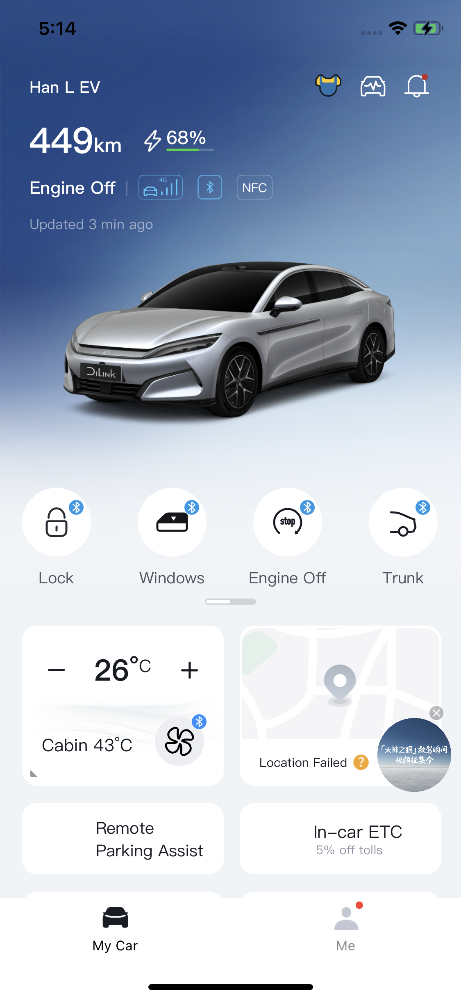
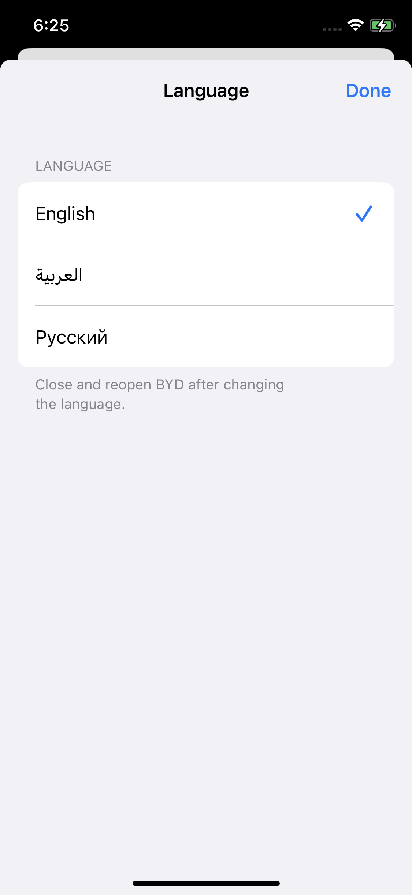
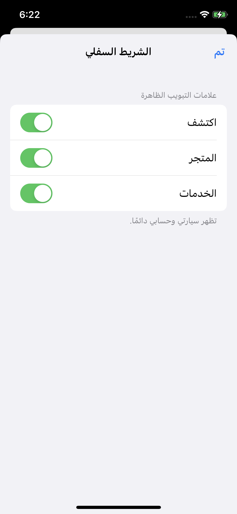
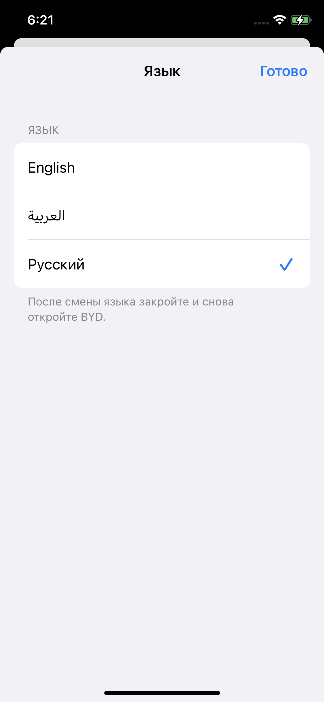

# تطبيق BYD للآيفون بلغتك

[**English**](README.md) · [**العربية**](README.ar.md) · [**Русский**](README.ru.md)

ترجمة غير رسمية للتطبيق الصيني من BYD على آيفون، مع خيارات لتخصيص الشريط السفلي. **نسخة تجريبية عامة · المراجعة الرابعة**، مبنية على BYD **9.16.0**. **لا تحتاج إلى جيلبريك.**

[**صفحة التنزيل بالعربية والإضافة إلى AltStore Classic**](https://shihabal3amri.github.io/BYD-iOS/ar/) · [**تنزيل IPA**](https://github.com/shihabal3amri/BYD-iOS/releases/tag/v9.16.0-r4) · [**الإبلاغ عن مشكلة**](https://github.com/shihabal3amri/BYD-iOS/issues/new?template=beta-feedback.md)

**يجب تثبيت وإعداد AltStore Classic أولًا.** الزر يضيف مصدر BYD، ولا يثبّت AltStore نفسه. المشروع والتنزيلات مجانية. هذا مصدر لـ AltStore Classic، وليس إدراجًا في AltStore PAL. يتطلب الإعداد الأولي كمبيوتر.

## الجديد في المراجعة الرابعة: الويدجت

عودة ويدجت الشاشة الرئيسية وشاشة القفل، بالعربية والإنجليزية والروسية. يتضمن التحديث إصلاح أيقونات التحكم، وعرض وقت التحديث المحلي، واستعادة الأيقونات المفقودة في بطاقات التطبيق.

عندما يسألك AltStore، اختر **Keep App Extensions** للاحتفاظ بالويدجت. بعد التحديث، افتح BYD واتركه نحو 30 ثانية، ثم أضف ويدجت BYD من قائمة الويدجت. قد تحتاج الويدجت الموجودة إلى بعض الوقت للتحديث، وهي تتبع اللغة التي اخترتها داخل BYD.

يحتوي BYD على أربع إضافات للويدجت؛ يستخدم التطبيق مع إضافاته خمسة App IDs إجمالًا. تحقّق من المتاح في AltStore → My Apps → View App IDs. [شرح AltStore لحدّ App IDs.](https://faq.altstore.io/altstore-classic/app-ids)

## المميزات

- اختر العربية أو الإنجليزية أو الروسية من **Me → Settings → Language**.
- أظهر أو أخفِ تبويبات **Discover (الاكتشاف)** و**Mall (المتجر)** و**Service (الخدمة)**، كلًا على حدة، من **Me → Settings → Bottom bar**.
- يظهر تبويب **سيارتي (My Car)** بأيقونة السيارة الأصلية بدلًا من الرسم الصيني.
- تظهر شارات البلوتوث على عناصر التحكم المدعومة عند اتصال السيارة.
- تتضمن النسخة الإصلاحات السابقة للتشغيل والاتصال والتعطل بعد تسجيل الدخول ونوافذ التأكيد المترجمة.

بعد تغيير اللغة، أغلق BYD بالكامل من مبدّل التطبيقات ثم أعد فتحه. يتغير ظهور التبويبات فورًا، ويظل تبويبا سيارتي وأنا متاحين.

<p>
  <a href="assets/dashboard-r2.png"></a>
  <a href="assets/language-en.png"></a>
  <a href="assets/bottom-bar-ar.png"></a>
  <a href="assets/language-ru.png"></a>
</p>

لقطات حقيقية من آيفون. اضغط على أي صورة لعرضها بالحجم الكامل.

<a id="install-or-update"></a>

## التثبيت أو التحديث

### إعداد AltStore للمرة الأولى

ثبّت **AltServer على كمبيوتر Mac أو Windows**، ثم استخدمه لتثبيت **AltStore Classic على آيفون**. استخدم **حساب Apple الخاص بك**؛ لا تحتاج إلى اشتراك مطوّر مدفوع. يتضمن الإعداد الأولي توصيل الهاتف بكابل USB والموافقة على الوثوق بالكمبيوتر، وتفعيل نمط المطوّر (Developer Mode) على iOS 16 أو أحدث.

- [شرح التثبيت بالفيديو بالعربية](https://youtu.be/05xOiC5TwQ8?si=iv-KIpAl5oyJoKnP)
- [شرح التثبيت بالفيديو بالإنجليزية](https://youtu.be/yLuyVakPpUM?si=QloJ8z-acfZEbB4v)
- الأدلة الرسمية المحدثة: [macOS](https://faq.altstore.io/altstore-classic/how-to-install-altstore-macos) · [Windows](https://faq.altstore.io/altstore-classic/how-to-install-altstore-windows)

تشرح الفيديوهات إعداد AltStore. قد تختلف الشاشات والخطوات باختلاف الإصدار. بعد الإعداد، أضف BYD وفق الخطوات التالية.

### تثبيت BYD من المصدر

1. افتح [صفحة المشروع](https://shihabal3amri.github.io/BYD-iOS/ar/) في Safari على آيفون واضغط **إضافة إلى AltStore Classic**.
2. وافق على إضافة المصدر **BYD iOS Localized**.
3. اختر **BYD Localized**، وراجع الأذونات، ثم ثبّته باستخدام حساب Apple الخاص بك.
4. افتح BYD وسجّل الدخول بحساب BYD الخاص بك، ثم اختر لغتك من الإعدادات. يظهر التطبيق باسم BYD على الشاشة الرئيسية.

إذا لم يفتح الزر AltStore، أضف هذا الرابط يدويًا من **Browse → Sources → +**:

```text
https://raw.githubusercontent.com/shihabal3amri/BYD-iOS/main/source.json
```

أبقِ AltServer قيد التشغيل ويمكن الوصول إليه عبر شبكة Wi-Fi نفسها أو كابل USB عند التثبيت أو التحديث أو تجديد التوقيع. مع حساب Apple المجاني، جدّد توقيع **AltStore وBYD معًا** قبل انتهاء صلاحية السبعة أيام. لا تحتاج إلى AltServer لمجرد فتح BYD ما دام توقيعه صالحًا. راجع [دليل AltServer الرسمي](https://faq.altstore.io/altstore-classic/altserver).

### تحديث نسخة مثبّتة

افتح AltStore بينما AltServer يعمل ويمكن الوصول إليه، واترك المصدر يتحدّث، ثم اختر **Update** بجانب BYD ضمن **My Apps**. ابحث عن **9.16.0 · Revision 4**، رقم البناء **202608311171**. احتفظ بالتطبيق المثبّت واستخدم حساب Apple نفسه للحفاظ على بياناته المحلية. حجم التنزيل نحو **349 ميجابايت**، وتعتمد سرعته على اتصالك بخوادم GitHub.

<a id="install-using-impactor"></a>

### التثبيت باستخدام Impactor

استورد IPA إلى [Impactor](https://github.com/claration/Impactor)، واترك اسم التطبيق **BYD** مع الاحتفاظ بجميع إضافات الويدجت، ثم وقّع وثبّت باستخدام حساب Apple الخاص بك. احتفظ بالإعدادات المعتادة لمعرّف التطبيق ومجموعاته. إذا ظهر Developer API error 35 بشأن `appIdName`، تأكد أن Name هو BYD وأعد المحاولة. تنزيل IPA وحده لا يثبّت التطبيق.

## الفتح عند الاقتراب · ميزة تجريبية اختيارية

افتح **Me → Settings → Walk-up unlock** (أنا ← الإعدادات ← الفتح عند الاقتراب). افتح السيارة عند الاقتراب واقفلها اختياريًا عند الابتعاد باستخدام مفتاح BYD للبلوتوث المفعّل لديك. العمليات التلقائية ودعم الموقع ورصد الحركة وتسجيل الاختبارات **متوقفة افتراضيًا للمستخدمين الجدد**. يحتفظ مستخدمو نسخ الاختبار الخاصة بإعداداتهم المحفوظة.

1. تأكد من عمل الفتح والقفل العاديين عبر بلوتوث BYD. افتح **اختر مسافاتك (Choose your distances)**، وقِس موضعي الفتح والقفل والهاتف في المكان الذي تحمله فيه عادة، ثم احفظ. تتوقف العمليات التلقائية أثناء فتح المعايرة.
2. فعّل **الفتح عند الاقتراب** و**القفل عند الابتعاد** إن رغبت. ابدأ بعيدًا عن السيارة، ثم اقترب وابتعد وتحقق مما فعلته السيارة فعليًا. عاير كل هاتف على حدة.
3. للعمل والشاشة مقفلة، افتح **الاكتشاف في الخلفية ← دعم الموقع**، واتبع طلبات الأذونات واستخدم **السماح بالموقع في الخلفية** عند ظهوره. رصد الحركة اختياري ويطلب إذن الحركة واللياقة. أعد فتح BYD بعد إعادة تشغيل الهاتف أو إغلاق التطبيق بالكامل.

قد يزيد دعم الخلفية استهلاك البطارية، ولا نضمن الاستمرار دون انقطاع أو طوال الليل. تعالج هذه الميزة الموقع على الهاتف ولا تحفظ الإحداثيات أو ترفعها. لميزات الموقع الأخرى في BYD إعداداتها الخاصة.

**مشكلة معروفة على XS:** سجّل جهاز iPhone XS واحد قراءات إشارة غير متسقة وفتحًا غير مقصود للسيارة من داخل المنزل، واستمرت قراءات الإشارة غير المتسقة بعد تحديث iOS 18.7.10. السبب غير محسوم ولم يثبت وجود عطل في الجهاز. إذا تداخلت قراءات القرب والبعد أو حدثت عمليات غير مقصودة، أوقف الميزة وأبلغنا.

لإرسال ملاحظات، فعّل سجلات الاختبار قبل التجربة، وضع علامات عند اللحظات المهمة ثم صدّر السجل. اذكر طراز الهاتف وإصدار iOS وطراز السيارة وحدود الإشارة وحالة الشاشة واستجابة السيارة الفعلية. راجع السجلات قبل مشاركتها علنًا.

[الإبلاغ عن سلوك الفتح عند الاقتراب](https://github.com/shihabal3amri/BYD-iOS/issues/new?template=walkup-feedback.md)

## التوافق والحالة الحالية

تم تأكيد عمل بيانات الويدجت وأيقوناته وأوامره في الاختبارات الخاصة على iPhone XS دون جيلبريك. اجتاز إصلاح مساحة رقم المدى الأخير في المراجعة الرابعة اختبارات عرض بالعربية والإنجليزية والروسية. لا يزال تحديث النسخة العامة نفسها على الهاتف بانتظار التحقق.

يتطلب iOS 15 أو أحدث. لم تُختبر كل الهواتف والسيارات أو الاستمرارية طوال الليل. لا تزال مشكلة الإشارة المبلّغ عنها على XS غير محسومة. تبقى بعض النصوص والصور بالصينية، وقد تظهر صفحة الملف الشخصي فارغة.

تبقى الترجمة العربية والإنجليزية والروسية وتخصيص التبويبات وشارات البلوتوث متاحة. لا تزال بعض النصوص الصينية وصفحة الملف الشخصي الفارغة دون حل. الإشعارات الفورية ومفاتيح Wallet والميزات المقيّدة من Apple غير متاحة أو غير مؤكدة في هذه النسخة. سبق التحقق من تثبيت النسخة العامة السابقة وتشغيلها عبر AltStore Classic على XS.

## التجربة والملاحظات

جرّب التثبيت والتشغيل وتسجيل الدخول والتنقل بين سيارتي والإعدادات. جرّب اللغات مع إغلاق التطبيق بالكامل بين التغييرات، ثم تأكد من حفظ خيارات إظهار التبويبات وإخفائها.

أرسل أي تعطل أو نص غير مترجم أو مشكلة في التنسيق عبر [GitHub Issues](https://github.com/shihabal3amri/BYD-iOS/issues/new?template=beta-feedback.md)، مع ذكر طراز آيفون وإصدار iOS وأداة التثبيت وإصدارها ومراجعة BYD، وهل حدثت المشكلة عند تثبيت جديد أم تحديث أم تجديد توقيع.

استخدم حساب Apple ومعرّف التثبيت نفسيهما للتحديثات التالية للحفاظ على البيانات المحلية. لا تحذف التطبيق عند إجراء تحديث عادي.

قبل نشر صور أو سجلات علنًا، احذف بيانات الحساب وأرقام الهواتف وأرقام هياكل السيارات والمواقع ومعرّفات الأجهزة والرموز السرية. بيانات حساب Apple تُدخل في أداة التثبيت، وليس في بلاغات GitHub.

## التنزيل والتحقق

تتضمن [صفحة الإصدار](https://github.com/shihabal3amri/BYD-iOS/releases/tag/v9.16.0-r4) ملف IPA و**SHA256SUMS** و**verification.json**. يسجّل [release.json](release.json) بصمة الملف وحالة التحقق وقت تجهيز الإصدار. الحزمة قابلة لإعادة التوقيع، ولا تحتوي على ملف تزويد شخصي للمطوّر أو بيانات تسجيل الدخول من الأجهزة.

للتحقق من تطابق المصدر والحزمة:

```sh
python3 scripts/validate_source.py /path/to/BYD-iOS_9.16.0_r4.ipa
```

## عن المشروع

هذا المستودع دليل تنزيل عام ومكان لاستقبال الملاحظات. المشروع غير تابع لـ BYD وغير معتمد منها، ولا يدّعي ملكية التطبيق الأصلي أو أصوله، ولا يمنح ترخيصًا لشفرة BYD المملوكة لها.

يبقى هدف الترجمة الكاملة قائمًا، مع مراجعة اللغات والمحتوى المتبقي وتوسيع اختبار ميزة الفتح عند الاقتراب.
